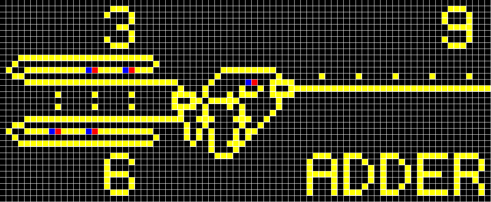
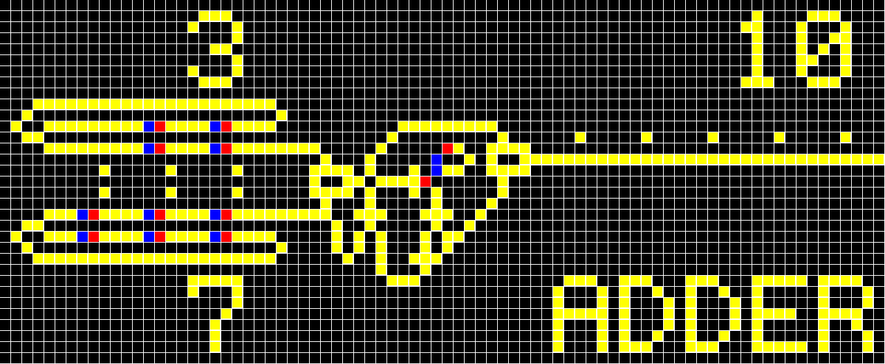

fava: Functional Programming Language on Scala
====


fava is a Turing complete, pure functional programming language, which was designed for the educational purpose in computational theory.

## Features

|Package|Feature|
|-------|-------|
|`univ` |universal Turing machine using two tapes|
|`regl` |parser combinators for regular languages|
|`gram` |parser combinators for parsing expression grammars (PEGs)|
|`math` |arithmetic calculator with a simple stack machine and PEG|
|`fava` |fava REPL|
|`lisp` |LISP REPL|
|`wire` |WireWorld|

## Documents

- [Scalaで自作するプログラミング言語処理系 (PDF)](https://nextzlog.dev/fava.pdf) [(HTML)](https://nextzlog.dev/fava.html)

## Usage

```sh
$ gradle build
$ java -jar build/libs/fava.jar --fava
fava$ "HELLO, WORLD!"
HELLO, WORLD!
fava$ compile(1 + 2)
Push(1) Push(2) IAdd
fava$ exit
$ java -jar build/libs/fava.jar --lisp
lisp$ (+ 1 2 3)
6
lisp$ (exit)
```

## Fava Examples

### basic operation

- fava supports some arithmetic, logic, and relational operations.

```Scala
fava$ 114 + 514
628
fava$ 3 > 1? "LOOSE": "WIN"
LOOSE
```

### lambda calculus

- fava does not accept local variable and function declarations, and block statements are also prohibited.

```Scala
fava$ ((x)=>(y)=>3*x+7*y)(2)(3)
27
```

### Church booleans

- fava is Turing complete and can theoretically define boolean operations without using system functions.

```Scala
fava$ ((l,r)=>l(r,(x,y)=>y))((x,y)=>x,(x,y)=>y)(true,false) // true & false
false
fava$ ((l,r)=>l((x,y)=>x,r))((x,y)=>x,(x,y)=>y)(true,false) // true | false
true
```

### Church numerics

- fava is Turing complete and can theoretically define numeric operations without using system functions.

```Scala
fava$ ((l,r)=>(f,x)=>l(f)(r(f)(x)))((f)=>(x)=>f(x),(f)=>(x)=>f(f(x)))((x)=>x+1,0) // 1 + 2
3
fava$ ((l,r)=>(f,x)=>l(r(f))(x))((f)=>(x)=>f(f(x)),(f)=>(x)=>f(f(x)))((x)=>x+1,0) // 2 * 2
4
```

### anonymous recursion

- fava evaluates function arguments lazily.

```Scala
fava$ ((f)=>((x)=>f(x(x)))((x)=>f(x(x))))((f)=>(n)=>(n==0)?1:n*f(n-1))(10)
3628800
```

## Lisp Examples

### name space

- Functions and variables are declared in the same namespace.

```lisp
lisp$ (set ’function-in-variable list)
list
lisp$ (function-in-variable 1 2 3 4 5)
(1 2 3 4 5)
```

### lambda definition

- Use the `define-lambda` macro to define a function.

```lisp
lisp$ (define-lambda fact (x) (if (eq x 1) x (* x (fact (- x 1)))))
(lambda (x) (if (eq x 1) x (* x (fact (- x 1)))))
```

### syntax definition

- Use the `define-syntax` macro to define a macro or syntax.

```lisp
lisp$ define-lambda
(syntax (name pars body) (list (quote setq) name (list (quote lambda) pars body)))
lisp$ define-syntax
(syntax (name pars body) (list (quote setq) name (list (quote syntax) pars body)))
```

## WireWorld

### 3 + 6



### 3 + 7



## Contribution

Pull requests are not accepted.
If you need enhancements, feel free to make issues at [nextzlog/todo](https://github.com/nextzlog/todo).

## License

### Author

[無線部開発班](https://nextzlog.dev)

### Clauses

[BSD 3-Clause License](LICENSE.md)
